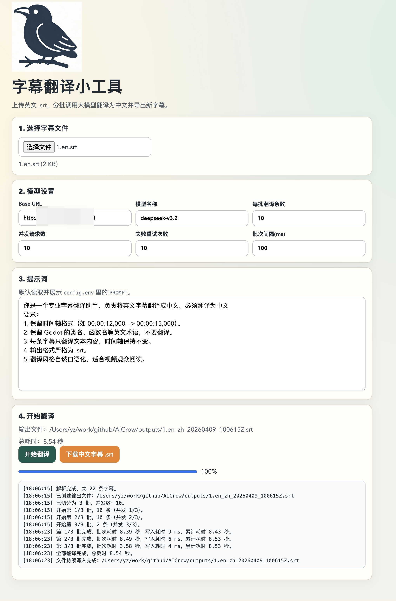

# AICrow 工具集

本项目包含四个本地小工具：
- 字幕翻译：上传英文 `.srt`，分批调用大模型翻译为中文，实时写入新字幕文件。
- JSON 展示：校验、格式化、压缩、树形浏览 JSON。
- 时间戳转换：秒/毫秒/微秒/纳秒 与日期时间互转，可选时区。
- PDF 拆分：上传本地 `.pdf`，按指定页数拆成多个小 PDF。


## 功能特性

- 上传 `.srt` 字幕文件并翻译为中文
- 支持 OpenAI 兼容接口
- 支持分批翻译与并发请求（保持写入顺序）
- 显示每批耗时和总耗时
- 翻译过程中实时写入 `outputs/` 文件
- 自动忽略空字幕条（保留原始序号，不重排）
- 内置 JSON 展示工具（校验、格式化、压缩、树形展开/收起）
- 支持本地 PDF 按页数拆分，并生成可下载的分片文件

## 环境要求

- Node.js `18+`（推荐 `20+`）
- npm `9+`
- Ghostscript（`gs`，用于 PDF 拆分）

## 快速开始

```bash
npm install
npm start
```

启动后访问：

- 时间戳转换（默认首页）：`http://localhost:3000`
- 字幕翻译：`http://localhost:3000/index.html`
- JSON 工具：`http://localhost:3000/json-tool.html`
- PDF 拆分：`http://localhost:3000/pdf-tool.html`

## 运行截图



## Chrome 扩展版

- 目录：`chrome-extension/`
- 点击工具栏图标会自动在新标签页打开时间戳转换（`timestamp.html`）
- 内含三个页面：`translator.html`（字幕翻译）、`json-tool.html`、`timestamp.html`
- 载入方式：Chrome 打开扩展管理 -> 打开“开发者模式” -> “加载已解压的扩展程序” -> 选择 `chrome-extension` 目录
- 字幕翻译（扩展版）直接调用 OpenAI 兼容接口，不再依赖本地服务；首次调用会弹出输入 API Key 的对话框；结果完成后自动触发下载

## config.env 使用说明

项目会从根目录读取 `config.env`。建议先新建该文件（或复制你自己的模板），内容示例：

```env
# 必填：模型服务 API Key
API_KEY=<YOUR_API_KEY>

# 必填：OpenAI 兼容接口地址（示例：你的网关或代理地址）
OPENAI_BASE_URL=<YOUR_OPENAI_COMPATIBLE_BASE_URL>

# 必填：模型名（示例：gpt-4.1 / glm-4-plus / deepseek-chat 等）
OPENAI_MODEL=<YOUR_MODEL_NAME>

# 可选：每批翻译条数
BATCH_SIZE=10

# 可选：并发请求数
CONCURRENCY=4

# 可选：失败重试次数
RETRY_COUNT=3

# 可选：批次间隔（毫秒）
DELAY_MS=100

# 可选：默认提示词（支持多行）
PROMPT=你是一个专业字幕翻译助手，负责将英文字幕翻译成自然中文。
要求：
1. 保留时间轴格式（如 00:00:12,000 --> 00:00:15,000）。
2. 保留 Godot 的类名、函数名等英文术语，不要翻译。
3. 每条字幕只翻译文本内容，时间轴保持不变。
4. 输出格式严格为 .srt。
5. 翻译风格自然口语化，适合视频观众阅读。
```

配置项说明：

| 配置项 | 说明 |
|---|---|
| `API_KEY` | 鉴权密钥 |
| `OPENAI_BASE_URL` | OpenAI 兼容 API 地址（不要带结尾 `/chat/completions`） |
| `OPENAI_MODEL` | 模型名称 |
| `BATCH_SIZE` | 每次提交给模型的字幕条数 |
| `CONCURRENCY` | 并发请求数（建议 2~8） |
| `RETRY_COUNT` | 单批失败重试次数 |
| `DELAY_MS` | 批次启动间隔（毫秒） |
| `PROMPT` | 页面初始提示词（支持多行） |

## 字幕翻译使用流程

1. 启动服务后打开网页
2. 上传英文 `.srt`
3. 检查模型参数与批量参数
4. 点击“开始翻译”
5. 查看实时日志、耗时和输出文件路径
6. 翻译完成后可下载浏览器导出的 `.srt`（可选）

## PDF 拆分使用流程

1. 打开 `http://localhost:3000/pdf-tool.html`
2. 选择本地 `.pdf` 文件
3. 输入“每个小 PDF 的页数”（例如 `5`）
4. 点击“开始拆分”
5. 在结果列表中点击文件名下载分片 PDF

拆分输出会保存到 `outputs/pdf-split/<任务目录>/`，文件命名示例：

- `your_file_part1_p1-5.pdf`
- `your_file_part2_p6-10.pdf`

## PDF 拆分接口（本地服务）

- 路径：`POST /api/pdf/split`
- 请求字段：
  - `sourceFileName`：源文件名（例如 `book.pdf`）
  - `pagesPerChunk`：每个分片页数（必须是大于 `0` 的整数）
  - `fileDataBase64`：PDF 的 base64 字符串（可包含 Data URL 前缀）
- 响应字段（简要）：
  - `totalPages`：源 PDF 总页数
  - `chunkCount`：拆分后文件数量
  - `outputDir`：输出目录
  - `files[]`：每个分片的文件名、页码范围、大小和下载 URL

## 常见问题

- 提示“未检测到 Ghostscript（gs）”
  - 请先安装 Ghostscript（macOS 可使用 `brew install ghostscript`），安装后重新启动服务
- 提示“PDF 文件过大”
  - 当前接口限制单文件 `80MB` 以内，建议先压缩 PDF 或分次处理

## 输出目录

- 实时写入文件：`outputs/`

## 安全建议

- 不要把真实 `config.env` 提交到版本库
- 不要在 README 或截图中暴露真实 API Key、Base URL、内部模型名
- 建议使用 `config.env.example` 作为共享模板，真实 `config.env` 仅保留在本地
