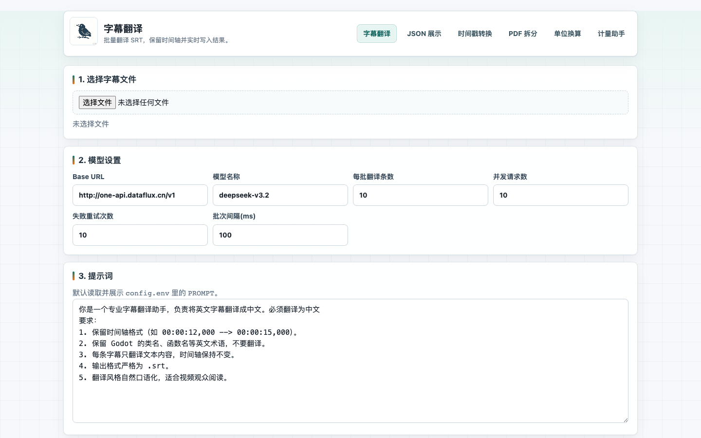
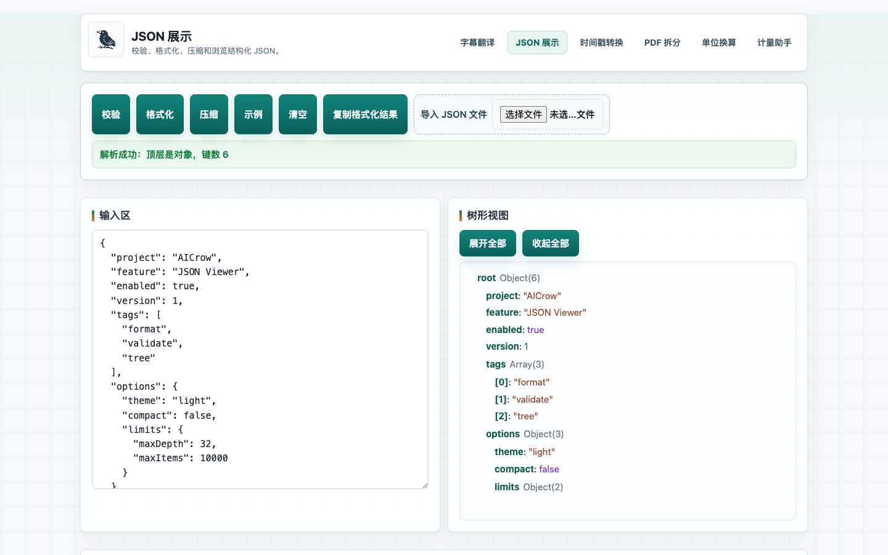
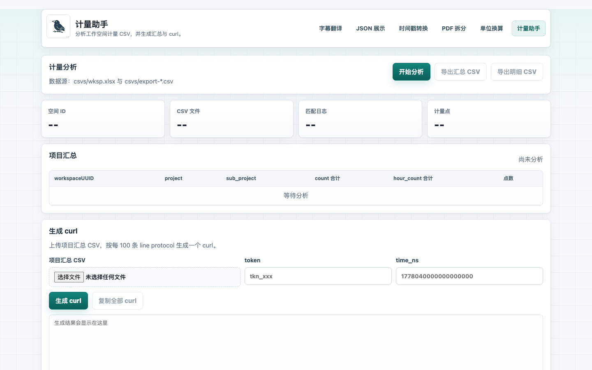
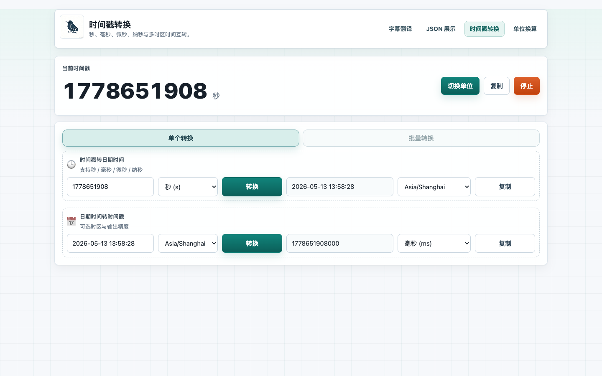

# 🐦 AICrow 工具集

一个轻量的本地效率工具箱，面向字幕翻译、JSON 查看、时间转换、PDF 拆分、单位换算和计量数据处理。  
支持本地 Web 服务，也提供 Chrome 扩展版，日常小工具不用到处开网页。


## ✨ 功能一览

| 工具 | 能做什么 | 入口 |
|---|---|---|
| 🎬 字幕翻译 | 上传英文 `.srt`，分批调用 OpenAI 兼容接口翻译为中文，并实时写入输出文件 | `/index.html` |
| 🧩 JSON 展示 | JSON 校验、格式化、压缩、复制和树形浏览 | `/json-tool.html` |
| ⏱️ 时间戳转换 | 秒 / 毫秒 / 微秒 / 纳秒 与日期时间互转，支持多时区 | `/timestamp.html` |
| 📄 PDF 拆分 | 上传本地 PDF，按指定页数拆成多个小 PDF | `/pdf-tool.html` |
| 📐 单位换算 | 数据大小、时间、流量、带宽、百分比、人民币和货币进制换算 | `/unit-converter.html` |
| 📊 计量助手 | 分析工作空间计量 CSV，生成汇总、明细 CSV 和上报 curl | `/metering-helper.html` |

## 🖼️ 运行截图

| 字幕翻译 | JSON 展示 |
|---|---|
|  |  |

| 计量助手 | Chrome 扩展版 |
|---|---|
|  |  |

## 🚀 快速开始

### 1. 安装依赖

```bash
npm install
```

### 2. 启动服务

```bash
npm start
```

默认访问地址：

```text
http://localhost:3000
```

常用页面：

| 页面 | 地址 |
|---|---|
| 字幕翻译 | `http://localhost:3000/index.html` |
| JSON 工具 | `http://localhost:3000/json-tool.html` |
| 时间戳转换 | `http://localhost:3000/timestamp.html` |
| PDF 拆分 | `http://localhost:3000/pdf-tool.html` |
| 单位换算 | `http://localhost:3000/unit-converter.html` |
| 计量助手 | `http://localhost:3000/metering-helper.html` |

## 🧰 环境要求

| 依赖 | 用途 |
|---|---|
| Node.js `18+` | 运行本地 Express 服务 |
| npm `9+` | 安装依赖和启动脚本 |
| Ghostscript `gs` | PDF 拆分功能需要 |

macOS 可通过 Homebrew 安装 Ghostscript：

```bash
brew install ghostscript
```

## 🔐 config.env 配置

字幕翻译会从项目根目录读取 `config.env`。建议本地创建该文件，不要提交真实密钥。

```env
# 必填：模型服务 API Key
API_KEY=<YOUR_API_KEY>

# 必填：OpenAI 兼容接口地址，不要带结尾 /chat/completions
OPENAI_BASE_URL=<YOUR_OPENAI_COMPATIBLE_BASE_URL>

# 必填：模型名，例如 gpt-4.1 / glm-4-plus / deepseek-chat
OPENAI_MODEL=<YOUR_MODEL_NAME>

# 可选：每批翻译条数
BATCH_SIZE=10

# 可选：并发请求数
CONCURRENCY=4

# 可选：失败重试次数
RETRY_COUNT=3

# 可选：批次间隔，单位毫秒
DELAY_MS=100

# 可选：默认提示词，支持多行
PROMPT=你是一个专业字幕翻译助手，负责将英文字幕翻译成自然中文。
要求：
1. 保留时间轴格式（如 00:00:12,000 --> 00:00:15,000）。
2. 保留 Godot 的类名、函数名等英文术语，不要翻译。
3. 每条字幕只翻译文本内容，时间轴保持不变。
4. 输出格式严格为 .srt。
5. 翻译风格自然口语化，适合视频观众阅读。
```

| 配置项 | 说明 |
|---|---|
| `API_KEY` | 鉴权密钥 |
| `OPENAI_BASE_URL` | OpenAI 兼容 API 地址 |
| `OPENAI_MODEL` | 模型名称 |
| `BATCH_SIZE` | 每次提交给模型的字幕条数 |
| `CONCURRENCY` | 并发请求数，建议 `2~8` |
| `RETRY_COUNT` | 单批失败重试次数 |
| `DELAY_MS` | 批次启动间隔，单位毫秒 |
| `PROMPT` | 页面初始提示词，支持多行 |

## 🧭 使用流程

### 🎬 字幕翻译

1. 启动服务后打开 `index.html`
2. 上传英文 `.srt`
3. 检查模型参数、批量参数和提示词
4. 点击「开始翻译」
5. 查看实时日志、耗时和输出路径
6. 翻译完成后下载中文字幕 `.srt`

翻译过程会实时写入：

```text
outputs/
```

### 📄 PDF 拆分

1. 打开 `pdf-tool.html`
2. 选择本地 `.pdf`
3. 输入每个小 PDF 的页数，例如 `5`
4. 点击「开始拆分」
5. 在结果列表中下载分片文件

拆分输出目录：

```text
outputs/pdf-split/<任务目录>/
```

文件命名示例：

```text
your_file_part1_p1-5.pdf
your_file_part2_p6-10.pdf
```

### 📐 单位换算

支持纯数字，也支持「数值 + 单位」输入：

```text
28717740816392 byte
```

结果会同时展示：

| 类型 | 说明 |
|---|---|
| 换算结果 | 按你选择的目标单位输出 |
| 智能展示 | 自动选择更易读的单位输出 |

说明：货币分类当前只做同币种单位换算，例如分 / 元，不做实时汇率换算。

### 📊 计量助手

默认读取：

```text
csvs/wksp.xlsx
csvs/export-*.csv
```

可生成：

| 输出 | 说明 |
|---|---|
| 项目汇总 CSV | 按 workspace / project / sub_project 汇总 |
| 明细 CSV | 保留空间维度和统计时间 |
| curl | 按 line protocol 批量生成上报请求 |

## 🧩 Chrome 扩展版

扩展目录：

```text
chrome-extension/
```

内含页面：

| 页面 | 文件 |
|---|---|
| 字幕翻译 | `translator.html` |
| JSON 展示 | `json-tool.html` |
| 时间戳转换 | `timestamp.html` |
| 单位换算 | `unit-converter.html` |

加载方式：

1. 打开 Chrome 扩展管理页
2. 开启「开发者模式」
3. 点击「加载已解压的扩展程序」
4. 选择 `chrome-extension/` 目录

扩展版字幕翻译会直接调用 OpenAI 兼容接口，不依赖本地服务。首次调用时会提示输入 API Key，翻译完成后自动下载结果。

## 🔌 PDF 拆分接口

```text
POST /api/pdf/split
```

请求字段：

| 字段 | 说明 |
|---|---|
| `sourceFileName` | 源文件名，例如 `book.pdf` |
| `pagesPerChunk` | 每个分片页数，必须大于 `0` |
| `fileDataBase64` | PDF 的 base64 字符串，可包含 Data URL 前缀 |

响应字段：

| 字段 | 说明 |
|---|---|
| `totalPages` | 源 PDF 总页数 |
| `chunkCount` | 拆分后文件数量 |
| `outputDir` | 输出目录 |
| `files[]` | 分片文件名、页码范围、大小和下载 URL |

## 🩺 常见问题

| 问题 | 处理方式 |
|---|---|
| 提示「未检测到 Ghostscript（gs）」 | 安装 Ghostscript 后重新启动服务 |
| 提示「PDF 文件过大」 | 当前接口限制单文件 `80MB` 以内，建议先压缩 PDF 或分次处理 |
| 字幕翻译没有读取到配置 | 确认根目录存在 `config.env`，并重新启动服务 |
| Chrome 扩展页面没有更新 | 在扩展管理页点击刷新，或重新加载 `chrome-extension/` |

## 🛡️ 安全建议

- 不要提交真实 `config.env`
- 不要在 README、截图或提交记录中暴露真实 API Key
- 不要把内部 Base URL、模型名或 token 放进公开仓库
- 建议使用 `config.env.example` 作为共享模板，真实配置只保留在本地

## 📁 目录速览

```text
.
├── index.html                 # 字幕翻译
├── json-tool.html             # JSON 展示
├── timestamp.html             # 时间戳转换
├── pdf-tool.html              # PDF 拆分
├── unit-converter.html        # 单位换算
├── metering-helper.html       # 计量助手
├── chrome-extension/          # Chrome 扩展版
├── assets/screenshots/        # README 运行截图
├── outputs/                   # 本地输出目录
└── server.js                  # Express 服务
```
